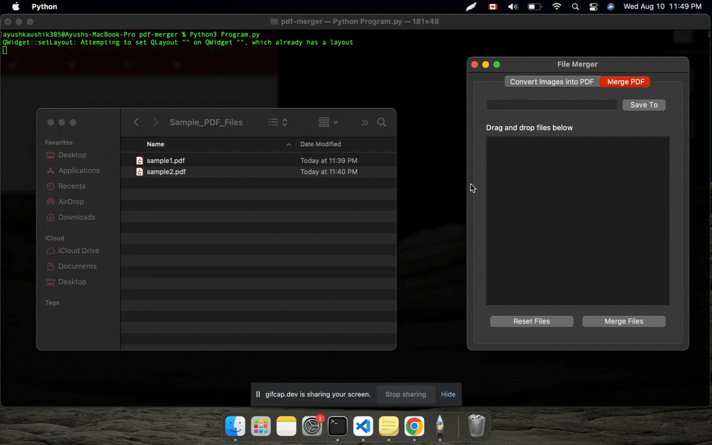
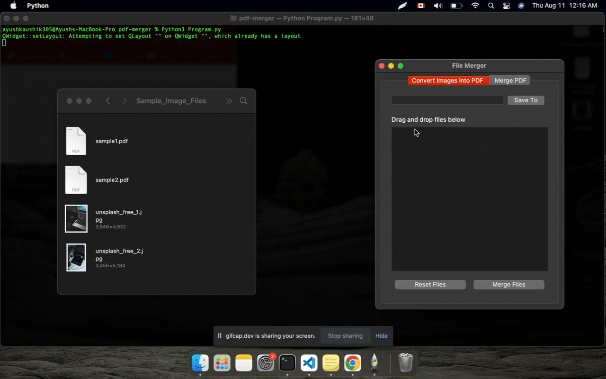
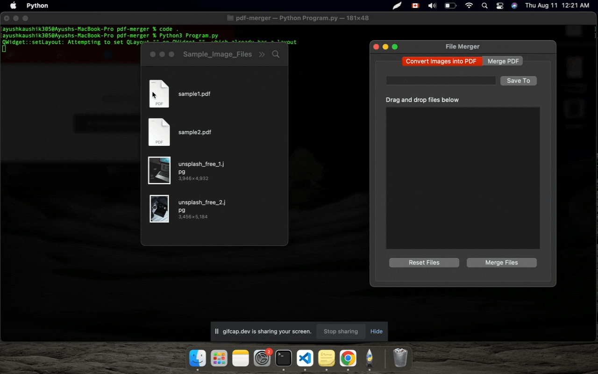

<h2 align="center">File Merger Desktop Application 🖨️ </h2> 

Merge `PDF`, `JPEG` and `PNG` files on your laptop with ease in a safe and secure manner with `File Merger`. No need to use online tools that could potentially store your personal data.

  
## 📝 Table of Contents  
- [About](#about)  
- [Deployment](#deployment) 
- [Usage](#usage)
- [Built Using](#built_using)
- [Acknowledgments](#acknowledgement)  
- [License](#license)  
  
## 🏁 About 
I had the idea to create this tool while working with large volume of PDF's containing `sensitive information`. 

Attaching multiple documents to an email is tedious and there are chances that a user could forget a file.

There are online "Free" options available but I didn't want to upload PDF's to as it could pose a security threat. 

I created this desktop application that merges all the `PDF's` files into single large file.

The tool currently supports following formats:

- `PDF`
- `JPG\JPEG`
- `PNG`

## 🚀 Deployment   
- Download latest release zip file
- Unzip the file and you'll find Program.exe file inside
- Double click the executable and it should start the program
  
## 🎈 Usage   
### Merging PDF Files

### Merging Images

### When incorrect file extension is drag-dropped

  
## ⛏️ Built Using   
- Python3
- PyPDF2
- PyQt5
  
## 👏 Acknowledgements     
- The free landing page has been acquired from here https://cruip.com/demos/solid/. All credit goes to their respective owners.
  
## 📝 License   
- MIT

