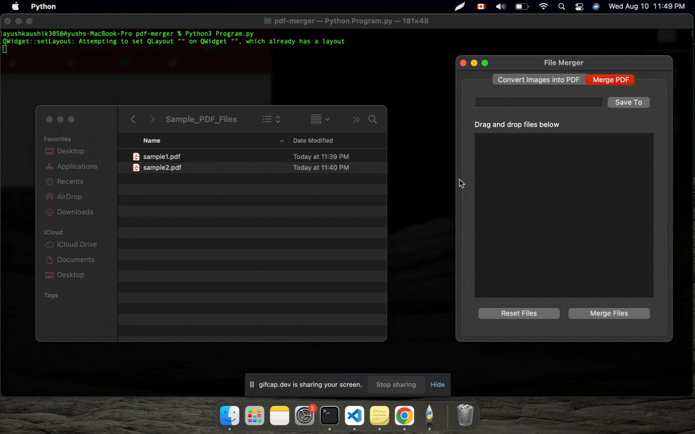
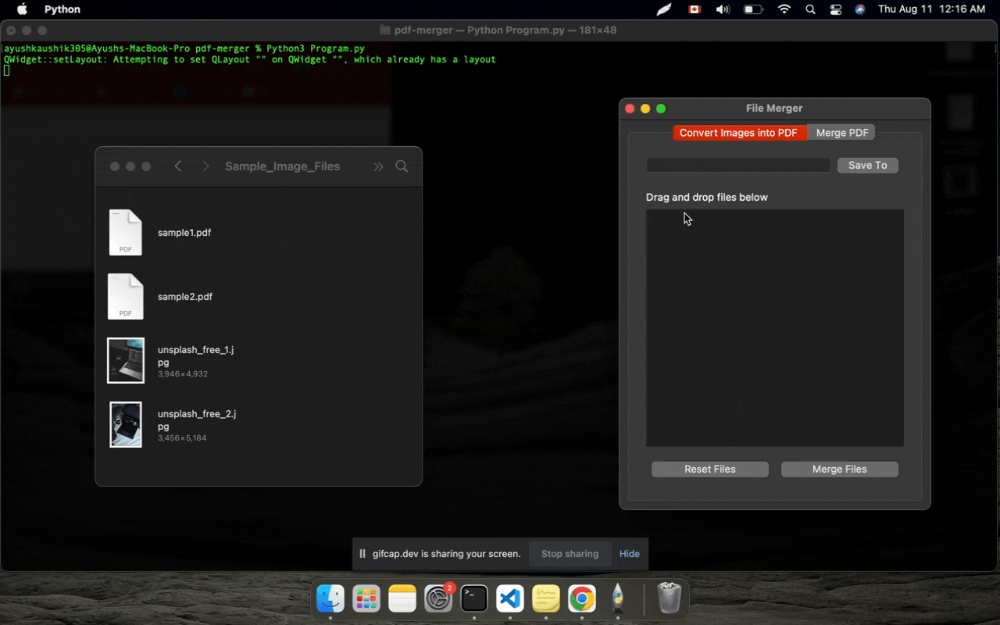
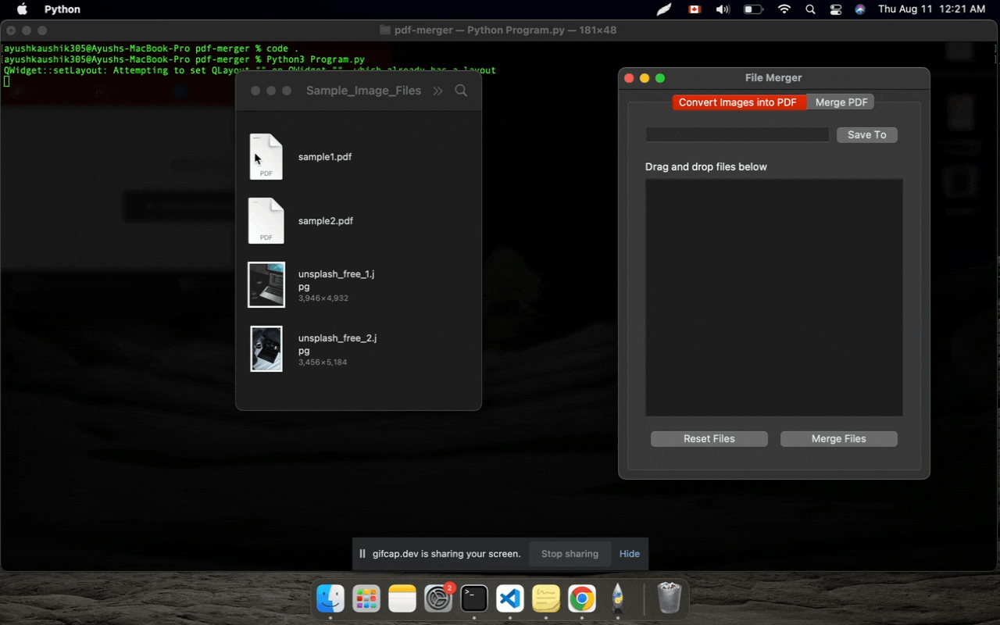

<h2 align="center">File Merger Desktop Application 🖨️ </h2>

Merge `PDF`, `JPEG` and `PNG` files on your laptop with ease in a safe and secure manner with `File Merger`. No need to use online tools that could potentially store your personal data.

## 👷 Build Status
| Branch | Status |
| --------------- | --------------- |
| Main | | 
| Release |  |

## 📝 Table of Contents  
- [About](#about)  
- [Deployment](#deployment) 
- [Usage](#usage)
- [Built Using](#built_using)
- [Acknowledgments](#acknowledgement)  
- [License](#license)  
  
## 🏁 About 
I created this tool to simplify the process of merging multiple files into a single large file while working with a large volume of PDF's containing sensitive information.

Attaching multiple documents to an email can be tedious, and there is a chance that a user could forget a file. Online free options are available, but they pose a security threat as it requires uploading PDF's.

This desktop application merges all the PDF, JPG\JPEG, and PNG files into a single large file.

The tool currently supports following formats:
- `PDF`
- `JPG\JPEG`
- `PNG`

## 🚀 Deployment   
- Download the latest release zip file
- Unzip the file and you'll find Program.exe file inside
- Double click the executable and it should start the program
  
## 🎈 Usage   
### Merging PDF Files

### Merging Images

### When incorrect file extension is drag-dropped

## ⛏️ Built Using 
- Python3
- PyPDF2
- PyQt5
  
## 👏 Acknowledgements 
- Free PDF's for testing found here: https://freetestdata.com/document-files/pdf/
- Sample image files found here: https://file-examples.com/
  
## 📝 License   
- MIT
